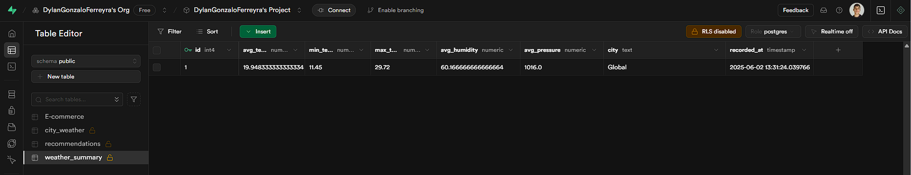
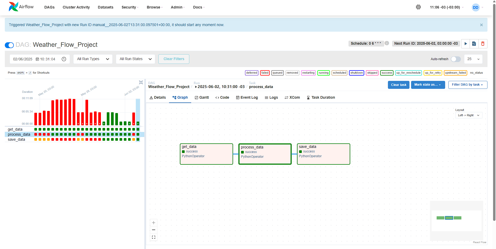

## **English**

---
An automated system for extracting, transform and storing meteorological data using OpenWeatherMap, Apache Spark, Supabase y Airflow.

# How It Works ⚙️

## **Español**

---
Un sistema automatizado para la extracción, transformación y almacenamiento de datos meteorológicos usando OpenWeatherMap, Apache Spark, Supabase y Airflow.

# Cómo Funciona ⚙️

1. **Obtener Datos de la Api (get_data_from_api):**

Los datos meteorológicos se obtienen de la API de OpenWeatherMap para varias ciudades en tiempo real. Esta función:
- Envía una solicitud a OpenWeatherMap para cada ciudad en CITIES (Buenos Aires, Madrid, Tokyo, New York, London, Brasilia).
- Extrae la temperatura, humedad y presión.
- Retorna una lista de diccionarios con los datos de cada ciudad.
  

2. **Procesamiento de datos (process_data):**

La función process_data procesa los datos obtenidos de la API usando Apache Spark. Se encarga de:
- Convertir los registros en un DataFrame de Spark.
- Calcular métricas globales como temperatura promedio, mínimas y máximas.
- Separar los datos en dos conjuntos:
- Datos individuales de cada ciudad (raw_data).
- Resumen global con promedios y valores extremos (calculated_data).

3. **Almacenamiento y Consumo (save_to_supabase):**

La función save_to_supabase guarda los datos procesados en Supabase, separando: los Registros individuales en la tabla city_weather del resumen global en weather_summary, agregando una columna "city": "Global" para identificar que es una métrica agregada.

# Services, Tools, etc. ☁️💾

- **OpenWeatherMap:** API usada para la extraccion de datos meteorologicos.
- **Apache Spark:** Framework usado para el procesamiento de los datos.
- **Apache Airflow:** Plataforma usada para la administracion del flujo de trabajo.
- **Supabase:** Alternativa a Firebase de código abierto usada para el almacenamiento de los datos

# Capturas del Proyect 📸 

🗺️ Datos meteorológicos procesados en Supabase

🔄 Flujo de trabajo en Airflow

🌆 Registros individuales por ciudad

